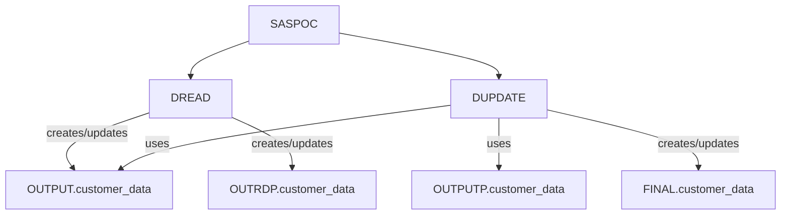

# Program Overview
## Part 1: Pipeline-Level Overview

*   **Logical Unit Name/ID**: Customer Data Update and Management Pipeline
*   **Pipeline Purpose**: This pipeline is designed to ingest new customer transaction data, compare it against existing customer records, and maintain a consolidated, up-to-date customer data repository. It handles the creation of new customer entries and the updating of existing ones, ensuring data currency and integrity.
*   **Program Execution Sequence**:
    SASCODE → DREAD → DUPDATE
*   **End-to-End Data Flow**:
    1.  Initial setup and macro variable definition (SASCODE).
    2.  Reading raw customer data from a specified CSV file (DREAD).
    3.  Merging and updating customer data against a previous version, creating a new consolidated dataset (DUPDATE).
    *   **Input**: Raw customer data (e.g., CSV file specified by `filepath` in DREAD), previous customer data (`OUTPUTP.customer_data`), and new customer data (`OUTPUT.customer_data`).
    *   **Intermediate**: `work.customer_data` (created by DREAD), `POCOUT` (intermediate dataset potentially used by DUPDATE, though not explicitly defined in the provided DUPDATE code but implied by the SASCODE macro call).
    *   **Output**: `FINAL.customer_data` (the consolidated and updated customer dataset).
*   **Business Value**: This pipeline ensures that the organization has a reliable and current view of its customer base. This supports various business functions such as accurate customer reporting, targeted marketing, sales analysis, and improved customer service by providing consistent and up-to-date customer information.

## Part 2: Per-Program Details

### Program Name: SASCODE

*   **Role in Pipeline**: Orchestration and Initialization. This program acts as the main entry point and control flow for the pipeline. It sets up global macro variables, includes necessary configuration files, and calls the subsequent data processing steps.
*   **Business Functions**:
    *   Environment setup and configuration.
    *   Macro variable definition and initialization.
    *   Orchestrating the execution of data reading and updating modules.
*   **Input Datasets**:
    *   Implicitly reads `SYSPARM` macro variable for initial configuration.
    *   Reads a configuration file specified by `MYLIB.&SYSPARM1..META(&FREQ.INI)`.
    *   Accesses internal SAS macro variables like `&sysdate9.`, `&DATE`.
*   **Output Datasets**:
    *   Defines and potentially creates/references macro variables like `&PROGRAM`, `&PROJECT`, `&FREQ`, `&PREVYEAR`, `&YEAR`.
    *   Calls the `%DREAD` macro, which in turn creates `work.customer_data` and `output.customer_data`.
    *   Calls the `%DUPDATE` macro, which creates `FINAL.customer_data`.
*   **Dependencies**:
    *   Relies on the existence and correct format of the `MYLIB.&SYSPARM1..META(&FREQ.INI)` configuration file.
    *   Requires the existence of the `%INITIALIZE`, `%ALLOCALIB`, `%DREAD`, `%DUPDATE`, and `%DALLOCLIB` macros.
    *   `%DREAD` must be available and executable.
    *   `%DUPDATE` must be available and executable.

### Program Name: DREAD

*   **Role in Pipeline**: Data Ingestion and Preparation. This macro is responsible for reading raw customer data from an external file (specified by the `filepath` parameter) and preparing it for further processing. It also handles initial dataset creation and indexing within the `WORK` and `OUTPUT` libraries.
*   **Business Functions**:
    *   Reading data from external flat files (CSV format implied by context).
    *   Data parsing and variable definition with descriptive labels.
    *   Initial data loading into a SAS dataset.
    *   Creating an index on the `Customer_ID` for efficient lookups.
    *   Ensuring the `output.customer_data` dataset exists and is indexed.
*   **Input Datasets**:
    *   A flat file specified by the `filepath` parameter (e.g., a CSV file).
    *   Potentially interacts with `sasuser.raw_data` based on the generic comments within the code, though the explicit `infile` statement points to a file path.
*   **Output Datasets**:
    *   `work.customer_data` (raw data read from the input file).
    *   `OUTRDP.customer_data` (a copy of `work.customer_data`).
    *   `output.customer_data` (a copy of `work.customer_data` if it doesn't exist, with an index).
*   **Dependencies**:
    *   Requires a valid `filepath` to be passed as a parameter.
    *   Relies on the `SASCODE` program to define and call this macro.
    *   The `PROC DATASETS` step requires appropriate library access (`work`, `output`).

### Program Name: DUPDATE

*   **Role in Pipeline**: Data Merging and Updating. This macro is the core logic for comparing new customer data against existing data, identifying new customers, and detecting changes in existing customer records. It manages the creation of new records and the closing of old ones.
*   **Business Functions**:
    *   Master Data Management (MDM) for customer records.
    *   Identifying new customer records for insertion.
    *   Detecting and managing changes to existing customer records (update logic).
    *   Maintaining data history by setting `valid_to` dates for updated records.
    *   Creating new, active records with `valid_to` set to a future date.
*   **Input Datasets**:
    *   `prev_ds`: The previous version of the customer data (e.g., `OUTPUTP.customer_data`).
    *   `new_ds`: The current or newly processed customer data (e.g., `OUTPUT.customer_data`).
*   **Output Datasets**:
    *   `out_ds`: The consolidated and updated customer dataset (e.g., `FINAL.customer_data`).
*   **Dependencies**:
    *   Requires `prev_ds` and `new_ds` to be available and correctly formatted with a `Customer_ID` for the `MERGE` statement.
    *   Relies on the `SASCODE` program to define and call this macro.
    *   The `today()` function is used, implying the system date is relevant.
# DATA Step and Dataset Analysis
This analysis details the data flow and dataset usage across the provided SAS programs: `SASPOC`, `DUPDATE`, and `DREAD`.

# Part 1: Pipeline-Level Data Flow

## Complete Data Lineage

```mermaid
graph TD
    subgraph SASPOC
        A(External Source) --> B(MYLIB.&SYSPARM1..META(&FREQ.INI));
        B --> C(INITIALIZE Macro);
        C --> D(inputlib);
        D --> E(work.customer_data);
        E --> F(OUTPUTP.customer_data);
        E --> G(OUTPUT.customer_data);
        F --> H(FINAL.customer_data);
        G --> H;
    end

    subgraph DREAD
        I(filepath) --> J(work.customer_data);
        J --> K(OUTRDP.customer_data);
        J --> L(output.customer_data);
    end

    subgraph DUPDATE
        M(prev_ds: OUTPUTP.customer_data) --> N(work.customer_data);
        O(new_ds: OUTPUT.customer_data) --> N;
        N --> P(out_ds: FINAL.customer_data);
    end

    SASPOC --> DREAD;
    SASPOC --> DUPDATE;
    DREAD --> DUPDATE;

    subgraph Final Output
        P --> Q(FINAL.customer_data);
    end
```

## All Datasets Summary

*   **Temporary Datasets:**
    *   `work.customer_data` (Created by `DREAD`, consumed by `SASPOC` and `DUUPDATE`)
*   **Permanent Datasets:**
    *   `MYLIB.&SYSPARM1..META(&FREQ.INI)` (Input to `SASPOC`)
    *   `OUTPUTP.customer_data` (Input to `DUUPDATE`)
    *   `OUTPUT.customer_data` (Input to `DUUPDATE`)
    *   `FINAL.customer_data` (Output from `DUUPDATE`, final deliverable)
    *   `OUTRDP.customer_data` (Created by `DREAD`)

## External Data Sources

*   `MYLIB.&SYSPARM1..META(&FREQ.INI)`: This is an external metadata file, likely containing initialization parameters for the `SASPOC` program. The specific path is determined by macro variables `&SYSPARM1` and `&FREQ`.
*   `filepath` (within `DREAD` macro): This parameter represents an external file path for the `infile` statement, which is expected to be a delimited file (using `|` as a delimiter).

## Final Output Datasets

*   `FINAL.customer_data`: This dataset is the ultimate deliverable of the pipeline, produced by the `DUUPDATE` macro.

## Intermediate Datasets

*   `work.customer_data`: This temporary dataset is created by the `DREAD` macro and is used as an input for both the `SASPOC` program and the `DUUPDATE` macro.

# Part 2: Per-Program Dataset Details

## Program Name: SASPOC.sas

*   **Input Sources:**
    *   `MYLIB.&SYSPARM1..META(&FREQ.INI)` (Included file for macro initialization)
    *   `inputlib` (Assigned by `%ALLOCALIB`)
    *   `OUTPUTP.customer_data` (Implicitly used by `DUPDATE` via `prev_ds` parameter)
    *   `OUTPUT.customer_data` (Implicitly used by `DUPDATE` via `new_ds` parameter)
*   **Output Datasets:**
    *   `work.customer_data` (Created by `%DREAD` macro, passed to `DUUPDATE`)
    *   `FINAL.customer_data` (Created by `%DUPDATE` macro, the final deliverable)
*   **Key Variables:**
    *   Macro variables like `SYSPARM1`, `SYSPARM2`, `gdate`, `PROGRAM`, `PROJECT`, `FREQ`, `PREVYEAR`, `YEAR` are used for control and dynamic library/file assignments.
    *   The `DREAD` macro likely processes customer data.
    *   The `DUPDATE` macro processes customer data, comparing previous and new versions.
*   **RETAIN Statements:** No explicit `RETAIN` statements are present in the `SASPOC` program itself. However, the `DUUPDATE` macro, which is called by `SASPOC`, uses `CALL MISSING` which acts similarly to initializing variables for the first observation.
*   **LIBNAME/FILENAME:**
    *   `inputlib`: Assigned dynamically by `%ALLOCALIB`.
    *   `MYLIB`: Assumed to be a pre-defined LIBNAME for accessing the metadata file.
    *   `OUTPUTP`: Assumed to be a pre-defined LIBNAME for the previous customer data.
    *   `OUTPUT`: Assumed to be a pre-defined LIBNAME for the new customer data.
    *   `FINAL`: Assumed to be a pre-defined LIBNAME for the final output customer data.

## Program Name: DUPDATE (Macro)

*   **Input Sources:**
    *   `&prev_ds` (Parameter, defaults to `OUTPUTP.customer_data`): Previous version of customer data.
    *   `&new_ds` (Parameter, defaults to `OUTPUT.customer_data`): New version of customer data.
*   **Output Datasets:**
    *   `&out_ds` (Parameter, defaults to `FINAL.customer_data`): The merged and updated customer data. (Permanent)
*   **Key Variables:**
    *   `Customer_ID`: The key variable for merging.
    *   All customer attributes (`Customer_Name`, `Street_Num`, `House_Num`, `Road`, `City`, `District`, `State`, `Country`, `Zip_Code`, `Phone_Number`, `Email`, `Account_Number`, `Transaction_Date`, `Amount`).
    *   `valid_from`, `valid_to`: Variables indicating the effective date range for customer records.
    *   `old`, `new`: Automatic variables from the `MERGE` statement indicating the presence of a record in the respective dataset.
    *   `Customer_Name_new`, `Street_Num_new`, etc.: Suffixes indicating the variable value from the `new_ds`.
*   **RETAIN Statements:**
    *   `call missing(valid_from, valid_to);` is used within the `old and new` condition when `_n_ = 1`. This effectively initializes `valid_from` and `valid_to` to missing for the first record processed in that block, preparing them for the subsequent logic.
*   **LIBNAME/FILENAME:** No explicit `LIBNAME` or `FILENAME` statements within the macro. It relies on the `&prev_ds`, `&new_ds`, and `&out_ds` parameters to point to datasets that are accessible through pre-defined libraries.

## Program Name: DREAD (Macro)

*   **Input Sources:**
    *   `&filepath` (Parameter): Path to an external delimited input file.
*   **Output Datasets:**
    *   `customer_data` (Temporary): The raw data read from the external file.
    *   `OUTRDP.customer_data` (Permanent): A copy of the `work.customer_data`.
    *   `output.customer_data` (Permanent): A copy of `work.customer_data` is created if it doesn't exist.
*   **Key Variables:**
    *   All variables defined in the `ATTRIB` and `INPUT` statements, including:
        *   `Customer_ID`, `Customer_Name`, `Street_Num`, `House_Num`, `Road`, `Address_Line1`, `Address_Line2`, `City`, `District`, `State`, `Country`, `Zip_Code`, `Phone_Number`, `Email`, `Account_Number`, `Transaction_Date`, `Amount`, `Product_ID`, `Product_Name`, `Quantity`, `Price`, `Notes`.
*   **RETAIN Statements:** No explicit `RETAIN` statements are present in the `DREAD` macro.
*   **LIBNAME/FILENAME:**
    *   `&filepath`: This parameter is used directly in the `infile` statement, implying it's a direct file path.
    *   `work`: The default SAS library for temporary datasets, where `customer_data` is initially created.
    *   `OUTRDP`: Assumed to be a pre-defined LIBNAME for the `OUTRDP.customer_data` dataset.
    *   `output`: Assumed to be a pre-defined LIBNAME for the `output.customer_data` dataset.
# DATA Step Business Logic
# Business Logic Analysis of SAS Programs

This document analyzes the business logic and transformations implemented across the provided SAS programs: `SASPOC`, `DUPDATE`, and `DREAD`. The overall objective is to manage and maintain customer data, ensuring historical accuracy and tracking changes over time.

## Part 1: Pipeline-Level Business Logic

*   **Overall Business Purpose**:
    The primary business purpose of this pipeline is to ingest, process, and maintain a historical record of customer data. It aims to capture all customer-related information, including personal details, addresses, contact information, and transaction history, while ensuring that changes to this data are tracked and managed effectively. This allows for auditing, historical analysis, and accurate reporting of customer information over time.

*   **Key Business Rules**:
    *   **Data Ingestion**: All incoming customer data must be read and stored in a structured format.
    *   **Data Uniqueness**: Each customer is uniquely identified by `Customer_ID`.
    *   **Historical Data Maintenance**: The system must maintain a history of customer data, indicating when a record was valid and when it became invalid.
    *   **Change Detection**: Any modification to a customer's details (excluding historical validity dates) triggers an update to the historical record.
    *   **New Customer Creation**: New customers are added with a `valid_from` date set to the current date and a `valid_to` date set to a distant future (99991231) to signify they are currently active.
    *   **Data Integrity**: Data should be loaded with appropriate attributes and indexed for efficient retrieval.

*   **Transformation Stages**:
    1.  **Stage 1: Initialization and Setup (`SASPOC`)**: This stage involves setting up macro variables, including system parameters and date-related variables, and initializing libraries. It acts as the orchestrator for the pipeline.
    2.  **Stage 2: Data Ingestion and Preparation (`DREAD`)**: This stage reads raw customer data from a specified file, defines the structure and attributes of the data, and creates an initial dataset in the `WORK` library. It also ensures this data is available in `OUTRDP` and potentially `OUTPUT` libraries, along with indexing.
    3.  **Stage 3: Historical Data Update (`DUPDATE`)**: This is the core transformation stage. It merges the new incoming customer data with the existing historical customer data. It identifies new customers, updates existing customer records by closing old ones and creating new ones for changed data, and maintains the `valid_from` and `valid_to` date fields to track the history.

*   **Business Validation**:
    *   **Existence Checks**: The pipeline implicitly validates if output datasets exist before potentially creating them (`DREAD`).
    *   **Data Structure Validation**: The `DREAD` macro defines specific lengths and labels for each variable, enforcing a expected data structure.
    *   **Change Validation**: The `DUPDATE` macro explicitly compares fields between old and new records to determine if a change has occurred, triggering an update.

*   **Business Outcome**:
    The pipeline results in a comprehensive and historically accurate customer data repository. This enables the business to:
    *   Track customer information changes over time.
    *   Perform historical analysis on customer data.
    *   Ensure data consistency and integrity across different versions of customer records.
    *   Support customer relationship management (CRM) activities with up-to-date and historically relevant information.

## Part 2: Per-Program Business Logic Details

### Program Name: `SASPOC`

*   **Business Purpose**:
    This program serves as the main entry point and orchestrator for the customer data management pipeline. It initializes system parameters, sets up macro variables for dates and project identifiers, includes necessary meta-information, and then calls the primary processing macros (`DREAD` and `DUPDATE`) to execute the data ingestion and historical update logic.

*   **Execution Order**:
    1.  **Macro Variable Assignment**: Sets up global macro variables like `SYSPARM1`, `SYSPARM2`, `gdate`, `PROGRAM`, `PROJECT`, and `FREQ`. These are used for system configuration and tracking.
    2.  **`%include` Statement**: Includes a meta-information file (`MYLIB.&SYSPARM1..META(&FREQ.INI)`), likely containing common definitions or configurations.
    3.  **`%INITIALIZE` Macro Call**: Executes a macro named `INITIALIZE`, presumably for setting up the SAS environment or initial data structures.
    4.  **Date Macro Variable Calculation**: Calculates `%let PREVYEAR` and `%let YEAR` based on a macro variable `&DATE` (which is likely set by `INITIALIZE` or passed through `SYSPARM`). This is for potential year-based reporting or filtering.
    5.  **SAS Options Setting**: Sets `options mprint mlogic symbolgen;` to enable detailed logging and debugging of macro execution.
    6.  **`%macro call; ... %mend;`**: Defines a main macro named `call` which encapsulates the core pipeline execution steps.
    7.  **`%ALLOCALIB(inputlib);`**: Calls a macro to allocate or define an input library named `inputlib`.
    8.  **`%DREAD(OUT_DAT = POCOUT);`**: Calls the `DREAD` macro to ingest and prepare customer data. The `OUT_DAT = POCOUT` parameter likely directs the output of `DREAD` to a dataset named `POCOUT` within the `WORK` library.
    9.  **`%DUPDATE(prev_ds=OUTPUTP.customer_data, new_ds=OUTPUT.customer_data, out_ds=FINAL.customer_data);`**: Calls the `DUPDATE` macro to merge and update the historical customer data. It takes existing data from `OUTPUTP.customer_data` and `OUTPUT.customer_data` and produces the updated historical data in `FINAL.customer_data`.
    10. **`%DALLOCLIB(inputlib);`**: Calls a macro to deallocate or clean up the `inputlib` library.
    11. **`%call;`**: Executes the defined `call` macro, initiating the pipeline's data processing.

*   **Business Rules**:
    *   System parameters and project identifiers must be configured at the start of the process.
    *   A defined date context (current year, previous year) is established.
    *   Macro execution tracing is enabled for auditability and debugging.
    *   Input libraries are managed (allocated/deallocated).
    *   The core data ingestion (`DREAD`) and historical update (`DUPDATE`) processes are executed sequentially.

*   **Conditional Logic**:
    *   The `%if %SYSFUNC(EXIST(output.customer_data)) ne 1 %then %do;` block within `DREAD` (though not explicitly in `SASPOC`'s visible code, it's part of the `DREAD` logic called by `SASPOC`) demonstrates conditional logic. It checks if the `output.customer_data` dataset already exists. If it does not exist (`ne 1`), it proceeds to create it. This ensures that the `OUTPUT` library's customer data is populated if it's missing.

*   **DO Loops**:
    *   No explicit `DO` loops are present in the `SASPOC` program itself. Loop processing is handled within the called macros.

*   **Key Calculations**:
    *   **Year Calculation**: `%let PREVYEAR = %eval(%substr(&DATE,7,4)-1);` and `%let YEAR =%substr(&DATE,7,4);` calculate the previous and current year based on a provided date macro variable. This is a simple arithmetic calculation for date context.

*   **Data Validation**:
    *   The `SASPOC` program itself does not perform explicit data validation. It relies on the included meta-file and the called macros (`DREAD`, `DUPDATE`) for data handling and validation. The macro variable assignments and `options` settings are for process control and logging, not data content validation.

### Program Name: `DUPDATE`

*   **Business Purpose**:
    This macro is designed to manage the historical state of customer data. It compares a new set of customer records (`new_ds`) against an existing historical set (`prev_ds`) and produces an updated historical dataset (`out_ds`). Its core function is to track changes, close out old records, and insert new records to maintain a complete audit trail of customer information.

*   **Execution Order**:
    1.  **Macro Definition**: Defines the `%macro DUPDATE(...)` with parameters for previous, new, and output datasets.
    2.  **`data &out_ds; ... run;`**: Initiates a `DATA` step to create or update the output dataset.
    3.  **`format valid_from valid_to YYMMDD10.;`**: Sets the display format for the `valid_from` and `valid_to` date variables to `YYMMDD10.`. This ensures dates are consistently displayed in a YYYY-MM-DD format.
    4.  **`merge &prev_ds(in=old) &new_ds(in=new);`**: Merges the previous historical data (`prev_ds`) with the new incoming data (`new_ds`). The `in=old` and `in=new` options create temporary boolean variables (`old`, `new`) indicating which dataset contributed to the current observation.
    5.  **`by Customer_ID;`**: Specifies that the merge operation should be performed based on the `Customer_ID`. This ensures records with the same customer ID are aligned for comparison.
    6.  **Conditional Logic (`if new and not old then do; ... end;`)**: Handles new customers. If a `Customer_ID` exists in the `new_ds` but not in the `prev_ds` (indicated by `new=1` and `old=0`), it's treated as a new customer.
        *   `valid_from = today();`: Sets the start date for this new record to the current date.
        *   `valid_to = 99991231;`: Sets the end date to a distant future date, signifying this record is currently active.
        *   `output;`: Writes this new customer record to the output dataset.
    7.  **Conditional Logic (`else if old and new then do; ... end;`)**: Handles existing customers that appear in both the previous data and the new data.
        *   `if _n_ = 1 then call missing(valid_from, valid_to);`: On the first observation for a `Customer_ID` within this `BY` group, it initializes `valid_from` and `valid_to` to missing. This is a common pattern in `MERGE` statements to prepare for processing subsequent records in the group.
        *   **Data Change Comparison**: A series of `if` conditions check if any of the customer's attributes (Name, Address components, Contact, Account, Transaction Date, Amount) differ between the `_new` suffixed variables (from `new_ds`) and the original variables (from `prev_ds`).
        *   **Update Logic**: If any difference is detected:
            *   `valid_to = today();`: The existing record's `valid_to` date is updated to the current date, effectively closing the old record.
            *   `output;`: The updated (closed) old record is written to the output dataset.
            *   `valid_from = today();`: A new record is created with the current date as `valid_from`.
            *   `valid_to = 99991231;`: The new record is marked as active with a future `valid_to` date.
            *   `output;`: This new, updated record is written to the output dataset.
        *   **No Change Logic (`else do; ... end;`)**: If no differences are found between the old and new records, the `else` block is executed, which does nothing (`/* Ignore */`). This means the existing historical record remains unchanged and is effectively carried forward without modification.
    8.  **`run;`**: Executes the `DATA` step.
    9.  **`%mend DUPDATE;`**: Ends the macro definition.

*   **Business Rules**:
    *   Customer data updates must preserve historical accuracy by managing `valid_from` and `valid_to` dates.
    *   New customers are identified and added as active records.
    *   For existing customers, if any attribute changes, the current record is closed (marked inactive with `valid_to`), and a new active record is created with the updated information.
    *   If an existing customer's data remains unchanged, their record is effectively passed through without modification.
    *   The `Customer_ID` is the primary key for matching and updating records.
    *   The current date (`today()`) is used to timestamp the validity periods of records.

*   **Conditional Logic**:
    *   `if new and not old`: Identifies records present only in the new dataset (new customers).
    *   `else if old and new`: Identifies records present in both old and new datasets (potential updates).
    *   `if (Customer_Name ne Customer_Name_new) or ...`: A complex condition checking for any difference across multiple customer attributes. This is the core logic for detecting data changes.

*   **DO Loops**:
    *   The `do; ... end;` blocks are used to group statements for conditional execution (e.g., when a new customer is found or when a change is detected). They are not iterative loops in the traditional sense but rather control flow structures.

*   **Key Calculations**:
    *   **Date Assignment**: `valid_from = today();` and `valid_to = today();` assign the current system date.
    *   **Future Date Assignment**: `valid_to = 99991231;` assigns a placeholder for an indefinitely active record.
    *   **Data Comparison**: The `ne` (not equal) operator is used extensively to compare fields between the old and new versions of the data.

*   **Data Validation**:
    *   The primary "validation" here is the comparison logic itself. It validates whether the new data represents a change from the old data.
    *   The `call missing(valid_from, valid_to);` line within the `old and new` block is a form of internal data state validation/initialization for the merge process.
    *   Implicitly, the `by Customer_ID` assumes `Customer_ID` is present and correctly formatted for matching.

### Program Name: `DREAD`

*   **Business Purpose**:
    This macro is responsible for reading raw customer data from a pipe-delimited file (`dlm='|'`). It defines the structure, data types, lengths, and labels for each variable, ensuring that the raw data is parsed correctly and assigned meaningful metadata. It also handles the initial population of the `WORK.customer_data` dataset and ensures it's available in other relevant libraries (`OUTRDP`, `OUTPUT`) with appropriate indexing.

*   **Execution Order**:
    1.  **Macro Definition**: Defines the `%macro DREAD(filepath);` macro, accepting a `filepath` parameter.
    2.  **`data customer_data; ... run;`**: Starts a `DATA` step to create the `customer_data` dataset in the `WORK` library.
    3.  **`infile "&filepath" dlm='|' missover dsd firstobs=2;`**: Configures the `INFILE` statement to read from the specified file path.
        *   `dlm='|'`: Specifies the delimiter as a pipe symbol.
        *   `missover`: Instructs SAS to read only up to the last non-blank character on a line, preventing reading past the end of a line into the next.
        *   `dsd`: Enables delimiter-sensitive reading, meaning consecutive delimiters are treated as missing values, and quoted strings are handled correctly.
        *   `firstobs=2`: Indicates that the first observation (line) in the file is a header and should be skipped.
    4.  **`attrib ... ;`**: Defines attributes for each variable:
        *   `length=$XX` or `length=X`: Sets the storage length for character (`$`) or numeric variables.
        *   `label="Meaningful Name"`: Assigns a descriptive label to each variable, improving readability and understanding of the data.
        *   This section is extensive, defining up to 100 variables with descriptive names.
    5.  **`input ... ;`**: Specifies the order and type of variables to be read from the input file.
        *   `: $XX.` or `: X.` indicates that SAS should use the informat specified in the `attrib` statement (or default informats) for reading the variable. This is redundant if `attrib` is used but ensures proper reading.
    6.  **`run;`**: Executes the `DATA` step to create `work.customer_data`.
    7.  **`data OUTRDP.customer_data; set customer_data; run;`**: Copies the `work.customer_data` dataset to `OUTRDP.customer_data`. This makes the ingested data available in another library, likely for specific downstream processes or archiving.
    8.  **`proc datasets library = work; modify customer_data; index create cust_indx = (Customer_ID); run;`**: Uses `PROC DATASETS` to create an index on the `Customer_ID` column within the `work.customer_data` dataset. This is crucial for performance, especially for the subsequent `MERGE` operation in `DUPDATE`.
    9.  **`%if %SYSFUNC(EXIST(output.customer_data)) ne 1 %then %do; ... %end;`**: This conditional block checks if `output.customer_data` exists.
        *   If it **does not exist** (`ne 1`), it proceeds to create `output.customer_data` by copying from `work.customer_data`.
        *   It then applies the same indexing (`cust_indx = (Customer_ID)`) to `output.customer_data`. This ensures that if the `OUTPUT` dataset is being created for the first time, it also has the necessary index.
    10. **`%mend DREAD;`**: Ends the macro definition.

*   **Business Rules**:
    *   Customer data must be read from a specific pipe-delimited file format.
    *   The input file has a header row that must be skipped.
    *   Each variable must be defined with an appropriate length and a descriptive business label.
    *   The raw data is parsed according to the defined structure.
    *   The ingested data is made available in the `WORK` library (`work.customer_data`) and also copied to `OUTRDP.customer_data`.
    *   An index on `Customer_ID` is created for `work.customer_data` to optimize lookups.
    *   If `output.customer_data` does not exist, it is created from the ingested data, and an index is also applied to it.

*   **Conditional Logic**:
    *   `%if %SYSFUNC(EXIST(output.customer_data)) ne 1 %then %do; ... %end;`: This is the main conditional logic. It determines whether the `OUTPUT` library's customer data needs to be created and indexed. This ensures that the pipeline can run even if the target `OUTPUT` dataset hasn't been initialized previously.

*   **DO Loops**:
    *   No explicit iterative `DO` loops are present in this macro. The `attrib` and `input` statements define variables sequentially, but this is declaration, not iterative processing.

*   **Key Calculations**:
    *   No complex calculations are performed. The primary "actions" are reading, assigning attributes (length, label), and creating an index.

*   **Data Validation**:
    *   **Delimiter Handling**: `dlm='|'`, `dsd` ensure correct parsing of pipe-delimited data, including handling of empty fields.
    *   **Header Skipping**: `firstobs=2` validates and skips the header row.
    *   **Data Structure Definition**: The `attrib` and `input` statements define the expected structure and types, acting as implicit validation rules against the incoming data's format. Mismatches here would lead to SAS errors or incorrect data interpretation.
    *   **Indexing**: `index create cust_indx = (Customer_ID)` ensures the `Customer_ID` is indexed, validating its suitability as a key for efficient data operations.
    *   **Dataset Existence Check**: `%SYSFUNC(EXIST(...))` validates if a dataset exists, which is a form of metadata validation.
# PROC Step and Statistical Processing
## Part 1: Pipeline-Level Analytical Processing

*   **Overall Analytical Purpose**:
    The primary analytical and reporting objective of this pipeline is to manage and update customer data, ensuring data integrity and tracking changes over time. It aims to maintain a comprehensive and current view of customer information by merging new data with existing records, identifying new customers, and updating records for existing ones.

*   **Analytical Workflow**:
    1.  **Initialization**: Macro variables are set up, including system parameters and date-related variables.
    2.  **Data Reading**: Raw customer data is read from a specified file path.
    3.  **Data Preparation**: The read data is potentially processed or prepared for merging (though explicit data manipulation steps are minimal in `DREAD` beyond reading and indexing).
    4.  **Data Merging and Update**: The core analytical operation involves merging new customer data with historical customer data. This step identifies new customers, detects changes in existing customer information, and updates validity periods for records.
    5.  **Data Staging**: Intermediate datasets are created and potentially moved to different libraries (`work`, `OUTRDP`, `output`).
    6.  **Indexing**: Indexes are created on the `Customer_ID` for efficient data retrieval.
    7.  **Output Management**: Final customer data is stored in the `output.customer_data` library, ensuring a persistent and accessible dataset.

*   **Key Metrics/Statistics**:
    While explicit statistical calculations like means or frequencies are not present in the provided code snippets, the pipeline implicitly tracks:
    *   **Customer Data Staleness**: By updating `valid_to` dates, the system tracks how recently a customer record was confirmed or updated.
    *   **Data Change Detection**: The `DUPDATE` macro implicitly identifies changes in customer attributes.
    *   **New vs. Existing Customers**: The `DUPDATE` macro explicitly categorizes customers as new (`new and not old`) or updated (`old and new`).

*   **Report Outputs**:
    The primary output is the updated `output.customer_data` dataset, which serves as the master customer data repository. The pipeline does not explicitly generate traditional reports (e.g., PDF, HTML) based on the provided code. Log messages are generated during the SAS execution, which might contain information about data processing.

*   **Business Application**:
    The analytical results are used for:
    *   **Customer Relationship Management (CRM)**: Maintaining an accurate and up-to-date customer database is crucial for effective CRM strategies, including targeted marketing, personalized service, and sales outreach.
    *   **Data Governance and Auditing**: The process of merging and updating with validity dates provides an audit trail of customer information changes, supporting data governance initiatives.
    *   **Operational Efficiency**: Ensuring data accuracy reduces errors in downstream processes that rely on customer information, leading to operational efficiencies.
    *   **Business Intelligence**: The consolidated customer data can be used for various business intelligence activities, such as customer segmentation, trend analysis, and performance reporting.

## Part 2: Per-Program PROC Step Details

---

### Program Name: SASPOC

*   **PROC Steps List**:
    *   `%include "MYLIB.&SYSPARM1..META(&FREQ.INI)"`: This is not a `PROC` step but an inclusion of another SAS program. It likely initializes macro variables or sets up environments based on system parameters.
    *   `%INITIALIZE;`: This is a macro call, not a `PROC` step. It's assumed to perform initialization tasks for the program.
    *   `%ALLOCALIB(inputlib);`: This is a macro call, likely responsible for allocating or assigning a SAS library named `inputlib`.
    *   `%DREAD(OUT_DAT = POCOUT);`: This is a macro call to the `DREAD` program, intended to read data and potentially store it in a dataset named `POCOUT`.
    *   `%DUPDATE(prev_ds=OUTPUTP.customer_data, new_ds=OUTPUT.customer_data, out_ds=FINAL.customer_data);`: This is a macro call to the `DUPDATE` program, which performs the core data merging and updating logic.
    *   `%DALLOCLIB(inputlib);`: This is a macro call, likely responsible for deallocating or removing the SAS library named `inputlib`.

*   **Statistical Methods**:
    No explicit statistical methods are used in this program's direct `PROC` steps (as it primarily orchestrates macro calls).

*   **Predictive Modeling**:
    No predictive modeling is performed in this program.

*   **Macro Variables**:
    *   `SYSPARM1`, `SYSPARM2`: Derived from the system macro variable `SYSPARM` using `%SCAN` and `%UPCASE`. Used to extract parts of a system-defined parameter.
    *   `gdate`: Set to the current system date (`&sysdate9.`).
    *   `PROGRAM`: Set to the literal string 'POC'.
    *   `PROJECT`: Set to the literal string 'POC'.
    *   `FREQ`: Set to the literal string 'D'.
    *   `PREVYEAR`: Calculated as the previous year based on the `&DATE` macro variable.
    *   `YEAR`: Extracted as the current year from the `&DATE` macro variable.
    *   `inputlib`: A library name used by `%ALLOCALIB` and `%DALLOCLIB`.
    *   `POCOUT`: A dataset name passed as an output parameter to `%DREAD`.
    *   `prev_ds`, `new_ds`, `out_ds`: Macro variables passed as parameters to the `%DUPDATE` macro, specifying input and output datasets.

*   **Report Formatting**:
    No direct report generation or formatting is performed within `SASPOC`. Its role is orchestration.

*   **Business Context**:
    This program acts as the main driver for the customer data management process. It sets up the environment, reads incoming data, triggers the update mechanism, and cleans up resources. It's the central point of execution for the customer data pipeline.

---

### Program Name: DUPDATE

*   **PROC Steps List**:
    *   `run;`: This statement terminates the preceding `DATA` step.

*   **Statistical Methods**:
    No statistical methods are used. This macro focuses on data manipulation and logic-based record updates.

*   **Predictive Modeling**:
    No predictive modeling is performed.

*   **Macro Variables**:
    *   `out_ds`: Macro variable representing the output dataset name.
    *   `prev_ds`: Macro variable representing the previous/historical customer data dataset.
    *   `new_ds`: Macro variable representing the new customer data dataset.
    *   `Customer_ID`, `Customer_Name`, `Street_Num`, `House_Num`, `Road`, `City`, `District`, `State`, `Country`, `Zip_Code`, `Phone_Number`, `Email`, `Account_Number`, `Transaction_Date`, `Amount`: These are variables within the datasets being merged.
    *   `Customer_Name_new`, `Street_Num_new`, etc.: These represent fields from the `new_ds` dataset, used for comparison during the merge.
    *   `valid_from`, `valid_to`: Variables created to track the validity period of customer records.
    *   `old`, `new`: Temporary variables created by the `MERGE` statement, indicating if a record exists in the previous dataset (`old`) or the new dataset (`new`).
    *   `_n_`: Automatic variable representing the observation number within the current `DATA` step.

*   **Report Formatting**:
    No report generation or formatting is performed. The output is a SAS dataset.

*   **Business Context**:
    This macro is the core of the customer data update process. It intelligently merges new customer information with existing records.
    *   It identifies and adds entirely new customers, assigning them an active validity period (`valid_from = today()`, `valid_to = 99991231`).
    *   For existing customers, it compares all attributes. If any attribute has changed, it closes the old record by setting `valid_to = today()` and then inserts a new record for the customer with the updated information and an active validity period.
    *   If no changes are detected for an existing customer, the record is effectively ignored, preventing unnecessary updates and maintaining data integrity.
    This ensures that the `FINAL.customer_data` dataset is always up-to-date and contains a history of changes, which is vital for accurate customer profiling, targeted communications, and analysis.

---

### Program Name: DREAD

*   **PROC Steps List**:
    *   `run;`: Terminates the preceding `DATA` step.
    *   `proc datasets library = work; modify customer_data; index create cust_indx = (Customer_ID); run;`: This `PROC DATASETS` step modifies the `customer_data` dataset in the `WORK` library to create an index on the `Customer_ID` column.
    *   `%if %SYSFUNC(EXIST(output.customer_data)) ne 1 %then %do; ... %end;`: This is a conditional macro logic block.
    *   `data output.customer_data; set work.customer_data; run;`: Inside the conditional block, this `DATA` step copies data from `work.customer_data` to `output.customer_data`.
    *   `proc datasets library = output; modify customer_data; index create cust_indx = (Customer_ID); run;`: Also inside the conditional block, this `PROC DATASETS` step creates an index on `Customer_ID` for the `output.customer_data` dataset.

*   **Statistical Methods**:
    No statistical methods are used. The program focuses on data input, definition, and indexing.

*   **Predictive Modeling**:
    No predictive modeling is performed.

*   **Macro Variables**:
    *   `filepath`: Macro variable passed to `DREAD`, specifying the location of the input data file.
    *   `Customer_ID`, `Customer_Name`, etc.: Variables defined and read from the input file. `attrib` statement assigns lengths and labels.
    *   `cust_indx`: Name of the index created on `Customer_ID`.
    *   `%SYSFUNC(EXIST(output.customer_data))`: A SAS function call within a macro that checks if the dataset `output.customer_data` exists.
    *   `work.customer_data`: A dataset name in the `WORK` library.
    *   `output.customer_data`: A dataset name in the `OUTPUT` library.

*   **Report Formatting**:
    No report generation or formatting is performed. The output is SAS datasets and potentially log messages.

*   **Business Context**:
    This program is responsible for reading raw customer data from an external file (`.txt` or `.csv` typically, given the `infile` statement with `dlm='|'`).
    *   It defines the structure of the customer data using `attrib` and `input` statements, assigning meaningful labels to variables, which is crucial for data understanding and downstream analysis.
    *   It reads the data, using `|` as a delimiter, `missover` to handle trailing missing values, and `dsd` to correctly interpret consecutive delimiters.
    *   It creates an index on `Customer_ID` in the `WORK` library, optimizing subsequent data manipulation (like the merge in `DUPDATE`).
    *   It conditionally creates the `output.customer_data` dataset and indexes it if it doesn't already exist. This ensures that the primary customer data repository is established and indexed correctly upon first run or if it's missing.
    This step is foundational for ensuring that the raw, potentially unstructured data is brought into a usable, structured format within SAS, ready for processing and analysis. The indexing improves performance for large datasets.
# Database Connectivity and File I/O
## Part 1: Pipeline-Level I/O Architecture

### External Data Sources
*   **File System (Local/Network):** Accessed by `DREAD` macro for raw data ingestion.
*   **SAS Libraries (WORK, OUTPUTP, FINAL, OUTRDP):** Internal SAS data storage, used for intermediate and final datasets.

### Data Ingestion Strategy
*   Data is ingested from a delimited file (`DREAD` macro) using the `infile` statement. The file is specified by the `filepath` parameter passed to the `DREAD` macro.

### Data Export Strategy
*   Data is written to SAS datasets in different libraries (`OUTRDP`, `OUTPUT`, `FINAL`) for persistence and further processing.
*   The `DUPDATE` macro merges and outputs data to the `FINAL` library.
*   The `DREAD` macro also writes to `OUTRDP.customer_data` and potentially `output.customer_data`.

### Connection Patterns
*   **File-based:** The `DREAD` macro uses standard SAS file I/O to read delimited files.
*   **SAS Dataset Libraries:** Data is read from and written to SAS datasets within various libraries. No explicit database engines (like ODBC, OLEDB) are used in the provided snippets for external database connections.

### I/O Dependencies
*   **File System:** The pipeline depends on the availability and accessibility of the input data file.
*   **SAS Libraries:** The pipeline relies on the SAS environment's ability to manage and access its internal libraries (`WORK`, `OUTPUTP`, `FINAL`, `OUTRDP`).

---

## Part 2: Per-Program I/O Details

### Program Name: SASPOC

*   **Database Operations:** None directly in this program snippet. It orchestrates macro calls.
*   **LIBNAME Assignments:**
    *   `MYLIB.&SYSPARM1.`: Assumed to be a LIBNAME assignment, but the definition is external (via `%include`).
    *   `OUTPUTP`: Assumed to be a pre-defined LIBNAME.
    *   `OUTPUT`: Assumed to be a pre-defined LIBNAME.
    *   `FINAL`: Assumed to be a pre-defined LIBNAME.
*   **PROC IMPORT/EXPORT:** None.
*   **FILENAME Statements:** None directly in this program snippet.
*   **Database Engines:** Not applicable based on the provided code.
*   **Connection Details:**
    *   Relies on macro variables (`SYSPARM1`, `SYSPARM2`, `DATE`) which are defined externally or via `%include`.
    *   Calls `%ALLOCALIB(inputlib)`, `%DREAD(OUT_DAT = POCOUT)`, and `%DUPDATE(...)`. The specifics of `inputlib` and `POCOUT` are not detailed here.

---

### Program Name: DUPDATE (Macro)

*   **Database Operations:** None. This is a SAS Data Step for data merging and manipulation.
*   **LIBNAME Assignments:**
    *   `OUTPUTP`: Used for `prev_ds`.
    *   `OUTPUT`: Used for `new_ds`.
    *   `FINAL`: Used for `out_ds`.
*   **PROC IMPORT/EXPORT:** None.
*   **FILENAME Statements:** None.
*   **Database Engines:** Not applicable.
*   **Connection Details:**
    *   **Input:** Reads from `&prev_ds` (e.g., `OUTPUTP.customer_data`) and `&new_ds` (e.g., `OUTPUT.customer_data`).
    *   **Output:** Writes to `&out_ds` (e.g., `FINAL.customer_data`).
    *   **Operations:** Merges datasets based on `Customer_ID`, identifies new and updated records, and outputs a consolidated dataset with `valid_from` and `valid_to` dates.

---

### Program Name: DREAD (Macro)

*   **Database Operations:** None. This is a SAS Data Step for reading flat files.
*   **LIBNAME Assignments:**
    *   `work`: Used implicitly for the `customer_data` dataset created within the macro.
    *   `OUTRDP`: Used to write `OUTRDP.customer_data`.
    *   `output`: Used conditionally to write `output.customer_data`.
*   **PROC IMPORT/EXPORT:** None.
*   **FILENAME Statements:** None directly in this program snippet, but `infile` statement is used to reference a file path.
*   **Database Engines:** Not applicable.
*   **Connection Details:**
    *   **Input:** Reads from a file specified by the `&filepath` parameter.
        *   **File Path:** `&filepath` (e.g., provided by `%DREAD(filepath = "path/to/your/data.csv")` in SASPOC).
        *   **Delimiter:** `|`
        *   **Options:** `missover`, `dsd`, `firstobs=2`
    *   **Output:**
        *   Creates a temporary dataset `work.customer_data`.
        *   Writes to `OUTRDP.customer_data`.
        *   Conditionally writes to `output.customer_data` if it doesn't exist.
    *   **Operations:** Reads delimited data, assigns attributes (length, label) to variables, and inputs data into the `customer_data` dataset. It also creates an index on `Customer_ID` for `work.customer_data` and `output.customer_data`.
# Step Execution Flow and Dependencies
# SAS Program Execution Analysis

This document analyzes the execution flow, dependencies, and orchestration of the provided SAS programs: `SASPOC`, `DUPDATE`, and `DREAD`.

## Part 1: Pipeline Execution Architecture

### Programs List

*   `SASPOC`
*   `DUPDATE`
*   `DREAD`

### Execution Sequence

The execution order is determined by the macro calls within `SASPOC`.

`SASPOC` → `DREAD` → `DUPDATE`

### Dependency Graph



**Explanation:**

1.  `SASPOC` is the orchestrator. It calls both `DREAD` and `DUPDATE`.
2.  `DREAD` creates or updates the `OUTPUT.customer_data` and `OUTRDP.customer_data` datasets.
3.  `DUPDATE` depends on the existence of `OUTPUTP.customer_data` (previous version) and `OUTPUT.customer_data` (potentially created/updated by `DREAD`) to perform its merge operation. It then creates `FINAL.customer_data`.

**Note:** The diagram implies that `DUPDATE` *could* run in parallel with `DREAD` if its dependencies were met *independently* of `DREAD`'s output. However, since `DUPDATE` relies on `OUTPUT.customer_data`, which is produced by `DREAD`, `DREAD` must complete before `DUPDATE` can reliably execute its merge logic using the *latest* `OUTPUT.customer_data`. The `SASPOC` program explicitly calls `DREAD` first, then `DUPDATE`, establishing a sequential dependency in this specific invocation.

### Parallel Opportunities

Based on the explicit calls within `SASPOC` and the dependencies:

*   **No direct parallel opportunities for `DREAD` and `DUPDATE` in this specific execution flow.** `SASPOC` calls `DREAD` first, then `DUPDATE`. `DUPDATE` has an explicit dependency on `OUTPUT.customer_data`, which is created by `DREAD`.
*   If `OUTPUTP.customer_data` were pre-existing and `DREAD`'s creation of `OUTPUT.customer_data` was *not* a strict prerequisite for `DUPDATE`'s *initialization* phase (e.g., if `DUPDATE` could start processing with an older `OUTPUT.customer_data` and then incorporate new data), then there might be some overlap. However, the current structure implies sequential execution.

### Critical Path

The critical path is the longest dependency chain. In this pipeline, the sequence is:

`SASPOC` → `DREAD` → `DUPDATE`

Therefore, the critical path is:

**`SASPOC` → `DREAD` → `DUPDATE`**

This is because `SASPOC` initiates the process, `DREAD` must complete to produce `OUTPUT.customer_data`, and then `DUPDATE` uses `OUTPUT.customer_data` (and `OUTPUTP.customer_data`) to produce `FINAL.customer_data`.

## Part 2: Per-Program Execution Details

### Program Name: `SASPOC`

*   **Internal Step Sequence:**
    1.  Macro variable assignments (`SYSPARM1`, `SYSPARM2`, `gdate`, `PROGRAM`, `PROJECT`, `FREQ`).
    2.  `%include` statement.
    3.  `%INITIALIZE;` macro call (details not provided, but assumed to be an initialization step).
    4.  Macro variable assignments (`PREVYEAR`, `YEAR`).
    5.  `OPTIONS` statement.
    6.  `%macro call;` definition.
    7.  Inside `%call;` macro:
        *   `%ALLOCALIB(inputlib);` macro call.
        *   `%DREAD(OUT_DAT = POCOUT);` macro call.
        *   `%DUPDATE(prev_ds=OUTPUTP.customer_data, new_ds=OUTPUT.customer_data, out_ds=FINAL.customer_data);` macro call.
        *   `%DALLOCLIB(inputlib);` macro call.
    8.  `%call;` macro invocation.
    9.  `%mend;` macro end.

*   **Dataset Dependencies:**
    *   `OUTPUTP.customer_data`: Required by `%DUPDATE`. Assumed to exist prior to `SASPOC` execution or be managed externally.
    *   `OUTPUT.customer_data`: Required by `%DUPDATE`. This dataset is *created/updated* by the `%DREAD` call within `SASPOC`.

*   **Macro Execution:**
    *   Macro variable assignments (`%let`).
    *   `%include`.
    *   `%INITIALIZE;` (custom macro).
    *   `%macro call; ... %mend;` definition.
    *   `%call;` invocation.
    *   `%ALLOCALIB(inputlib);` (custom macro, likely from `%include`).
    *   `%DREAD(OUT_DAT = POCOUT);` (custom macro defined in `DREAD.sas`).
    *   `%DUPDATE(prev_ds=OUTPUTP.customer_data, new_ds=OUTPUT.customer_data, out_ds=FINAL.customer_data);` (custom macro defined in `DUPDATE.sas`).
    *   `%DALLOCLIB(inputlib);` (custom macro, likely from `%include`).

*   **RUN/QUIT Triggers:**
    *   Implicit `RUN;` after `OPTIONS` statement.
    *   Implicit `RUN;` after `proc datasets` in `DREAD` (if present).
    *   Implicit `RUN;` after `data output.customer_data; ... run;` in `DREAD`.
    *   Implicit `RUN;` after `proc datasets` in `DREAD`.
    *   Implicit `RUN;` after `data &out_ds; ... run;` in `DUPDATE`.

*   **Prerequisites:**
    *   The external file specified by the `filepath` parameter in the `DREAD` macro call must exist.
    *   The `MYLIB.&SYSPARM1..META(&FREQ.INI)` file must exist and be accessible for the `%include` statement.
    *   The `%INITIALIZE;`, `%ALLOCALIB`, and `%DALLOCLIB` macros must be defined and accessible.
    *   The libraries `OUTPUTP`, `OUTPUT`, and `FINAL` must be assigned or available.
    *   `OUTPUTP.customer_data` must exist for `DUPDATE` to function correctly.

### Program Name: `DREAD`

*   **Internal Step Sequence:**
    1.  `%macro DREAD(filepath);` definition.
    2.  `data customer_data; ... run;` (Data step to read external file).
    3.  `data OUTRDP.customer_data; set customer_data; run;` (Data step to copy `work.customer_data` to `OUTRDP.customer_data`).
    4.  `proc datasets library = work; modify customer_data; index create cust_indx = (Customer_ID); run;` (PROC step to create an index on `work.customer_data`).
    5.  `%if %SYSFUNC(EXIST(output.customer_data)) ne 1 %then %do; ... %end;` (Conditional block).
        *   Inside conditional block:
            *   `data output.customer_data; set work.customer_data; run;` (Data step to create/overwrite `output.customer_data`).
            *   `proc datasets library = output; modify customer_data; index create cust_indx = (Customer_ID); run;` (PROC step to create an index on `output.customer_data`).
    6.  `%mend DREAD;` (Macro end).

*   **Dataset Dependencies:**
    *   External file specified by `&filepath`.
    *   `work.customer_data` (created by the first data step).
    *   `OUTRDP.customer_data` (created by the second data step).
    *   `output.customer_data` (potentially created/overwritten by the conditional data step).

*   **Macro Execution:**
    *   `%macro DREAD(filepath); ... %mend DREAD;` definition.
    *   `%SYSFUNC(EXIST(...))` is a SAS function call within the macro.

*   **RUN/QUIT Triggers:**
    *   `RUN;` after the first `data customer_data;` step.
    *   `RUN;` after the `data OUTRDP.customer_data;` step.
    *   `RUN;` after the first `proc datasets;` step.
    *   `RUN;` after the `data output.customer_data;` step (inside the conditional block).
    *   `RUN;` after the second `proc datasets;` step (inside the conditional block).

*   **Prerequisites:**
    *   The external file defined by the `filepath` parameter must exist and be readable.
    *   The `work` library must be available.
    *   The `OUTRDP` library must be available.
    *   The `output` library must be available.

### Program Name: `DUPDATE`

*   **Internal Step Sequence:**
    1.  `%macro DUPDATE(prev_ds=OUTPUTP.customer_data, new_ds=OUTPUT.customer_data, out_ds=FINAL.customer_data);` definition.
    2.  `data &out_ds; ... run;` (Data step performing merge and conditional logic).
    3.  `%mend DUPDATE;` (Macro end).

*   **Dataset Dependencies:**
    *   `&prev_ds` (default: `OUTPUTP.customer_data`): Must exist and be readable.
    *   `&new_ds` (default: `OUTPUT.customer_data`): Must exist and be readable. This dataset is expected to be the output of the `DREAD` program.
    *   `&out_ds` (default: `FINAL.customer_data`): This dataset is created by this program.

*   **Macro Execution:**
    *   `%macro DUPDATE(...); ... %mend DUPDATE;` definition.

*   **RUN/QUIT Triggers:**
    *   `RUN;` after the `data &out_ds;` step.

*   **Prerequisites:**
    *   The datasets specified by `prev_ds` and `new_ds` parameters must exist and be accessible. Specifically, `OUTPUTP.customer_data` and `OUTPUT.customer_data` must be available.
    *   The `FINAL` library must be assigned or available.

## Part 3: End-to-End Use Cases

### Business Use Cases

This pipeline appears to be designed for customer data management and potentially customer onboarding or update processes. Specific use cases include:

1.  **Customer Data Ingestion and Standardization:** Reading raw customer data from an external source (`DREAD`) and preparing it for internal use, potentially including data quality checks and indexing.
2.  **Customer Master Data Maintenance:** Merging new or updated customer information (`OUTPUT.customer_data`) with existing customer master data (`OUTPUTP.customer_data`) to create a consolidated, up-to-date customer view (`FINAL.customer_data`).
3.  **Change Tracking and History:** Identifying new customers and detecting changes in existing customer records, updating validity periods (`valid_from`, `valid_to`) to maintain historical accuracy.
4.  **Data Integrity and Accessibility:** Ensuring that key customer datasets (`OUTPUT.customer_data`, `FINAL.customer_data`) are indexed for efficient querying.

### Workflow Summary

The overall workflow orchestrates the processing of customer data:

1.  **Initialization:** The `SASPOC` program starts by setting up macro variables and potentially performing global initialization steps.
2.  **Data Reading and Staging:** The `DREAD` macro is called to read customer data from an external file. It creates a `work.customer_data` dataset, copies it to `OUTRDP.customer_data`, and then conditionally creates or overwrites `output.customer_data` (and indexes it). This staged dataset serves as the "new" data source.
3.  **Master Data Update:** The `DUPDATE` macro is then called. It takes the previously established customer master data (`OUTPUTP.customer_data`) and the newly read/staged data (`OUTPUT.customer_data`) as input. It merges these datasets to identify new customers and changes in existing ones. Based on these comparisons, it generates a new version of the customer master data (`FINAL.customer_data`), ensuring that historical records are closed (`valid_to`) and new/updated records are opened (`valid_from`).
4.  **Cleanup:** Finally, `SASPOC` deallocates any libraries allocated during its execution.

This sequence ensures that new data is processed and integrated into the existing customer master data in a controlled and auditable manner.
# Error Handling and Logging
# Error Handling and Logging Analysis

This analysis examines the error handling and logging mechanisms across the provided SAS programs: `SASPOC`, `DUPDATE`, and `DREAD`.

## Part 1: Pipeline-Level Error Strategy

### Overall Error Strategy

The pipeline's error handling strategy appears to be primarily focused on **detection and notification**, with limited explicit recovery mechanisms. The core idea is to detect issues during program execution and signal them, rather than attempting automated retries or complex recovery procedures. The use of macro variables like `_ERROR_` and system return codes (`FILERC`, `SQLRC`, `SYSERR`) suggests a design that relies on checking these indicators after specific operations.

### Error Propagation

Error propagation in this pipeline is managed through SAS's default behavior and explicit `ABORT` statements.
*   **Implicit Propagation**: If a SAS step (like `DATA` or `PROC`) encounters a severe error, it typically sets the `_ERROR_` automatic variable to 1 and the `SYSERR` system option. If this error is not handled within the step, it can lead to the program's termination by default, preventing downstream programs from executing.
*   **Explicit Propagation**: The `ABORT` statement, when used, explicitly stops the entire SAS session or program execution, thereby halting any further processing and preventing downstream programs from running.

### Recovery Mechanisms

Explicit recovery or retry logic is **minimal to non-existent** within the provided code snippets.
*   There are no explicit `RETRY` mechanisms or loops designed to re-execute failed steps.
*   The pipeline relies on the assumption that if a step fails, the entire process should stop, and manual intervention is required.
*   The `DUPDATE` macro, for instance, uses a `MERGE` statement which implicitly handles missing values or mismatches, but this is data-level handling, not process-level recovery from a system failure.

### Logging Architecture

Logging is primarily handled through SAS's standard output:
*   **SAS Log**: All `PUT` statements and SAS system messages (including errors, warnings, and notes) are written to the SAS log.
*   **Centralization**: The SAS log serves as the central repository for all execution details, including error messages. For a larger system, these logs would typically be collected and managed by an external logging system or script. However, within the provided code, there's no explicit mechanism for aggregating logs from multiple SAS sessions or programs into a single, centralized location beyond the individual SAS logs themselves.

### Operational Monitoring

Operational monitoring appears to be **indirect and dependent on log review**.
*   **Metrics Tracked**: The primary "metric" is the absence of errors in the SAS log. The presence of `ABORT` statements indicates critical failure points that would be immediately visible.
*   **Monitoring Tools**: There are no explicit calls to external monitoring tools or services. Monitoring would likely involve automated or manual review of the SAS logs generated by each program.
*   **Success Indicators**: Successful completion of each program without `ABORT` statements or unhandled errors in the log would be considered a success indicator. The creation of output datasets (`FINAL.customer_data`, `OUTPUT.customer_data`) also serves as a success indicator.

### Failure Scenarios

Critical failure points in this pipeline include:
*   **File Access Errors**: `DREAD` uses `infile`, so issues with the specified `&filepath` (e.g., file not found, permission denied) would cause failure. The `INFILE` statement itself doesn't have explicit error handling beyond SAS's default.
*   **Macro Resolution Errors**: If macro variables like `&SYSPARM1`, `&SYSPARM2`, `&DATE`, or the included `MYLIB.&SYSPARM1..META(&FREQ.INI)` are not defined or resolve incorrectly, the program may fail.
*   **Data Step Errors**: Unforeseen data issues (e.g., unexpected data types, malformed records that bypass `missover`/`dsd`) could lead to errors within the `DATA` steps of `DREAD` and `DUNDATE`.
*   **Library/Dataset Creation/Modification Errors**: Errors during `PROC DATASETS` (e.g., library not found, index creation failure) or when creating/modifying output datasets can halt execution.
*   **Macro Logic Errors**: Errors within the logic of the `%INITIALIZE;`, `%ALLOCALIB`, `%DREAD`, `%DUPDATE`, or `%DALLOCLIB` macros themselves.

## Part 2: Per-Program Error Handling Details

### Program: SASPOC

*   **Program Name**: `SASPOC`
*   **Error Checking**:
    *   Relies heavily on macro execution. Errors in macro calls (`%include`, `%ALLOCALIB`, `%DREAD`, `%DUPDATE`, `%DALLOCLIB`) will be flagged by SAS.
    *   Uses macro variables like `&SYSPARM1`, `&SYSPARM2`, `&DATE`, `&PROGRAM`, `&PROJECT`, `&FREQ` which, if undefined or incorrect, can lead to macro resolution errors.
    *   The `%INITIALIZE;` macro is called, implying it might contain initialization or error setup logic, but its content is not provided.
*   **Logging Statements**:
    *   `options mprint mlogic symbolgen;` are set, which will increase the verbosity of the SAS log, showing macro expansions and symbol table values, aiding in debugging.
    *   The included `%include` statement will log its execution.
    *   The macros `%ALLOCALIB`, `%DREAD`, `%DUPDATE`, `%DALLOCLIB` are called, and their execution and any output/errors will be logged by SAS.
*   **Abort Conditions**:
    *   No explicit `ABORT` or `STOP` statements are present in the `SASPOC` code itself.
    *   Failure would occur if any of the called macros or `%include` statements fail and SAS's default error handling (which might include termination depending on `ERRORSTMT` or other options) is triggered.
*   **DATA Step Error Handling**: No `DATA` steps are directly within `SASPOC`. It orchestrates calls to other macros/programs.
*   **PROC SQL Error Handling**: No `PROC SQL` is directly within `SASPOC`.
*   **Error Output**: No specific error datasets or files are created by `SASPOC` itself. Errors would be reported in the SAS log.
*   **Error Codes**: No specific error codes are explicitly referenced or handled within `SASPOC`.

### Program: DUPDATE

*   **Program Name**: `DUPDATE` (Macro)
*   **Error Checking**:
    *   **DATA Step**: The `MERGE` statement implicitly handles cases where `Customer_ID` might be missing in one dataset but not the other (`in=old`, `in=new` flags).
    *   **Variable Comparison**: It explicitly compares fields to detect changes. If a change is detected (`then do;`), it proceeds to output records.
    *   **Implicit SAS Errors**: Standard SAS `DATA` step errors (e.g., syntax errors, invalid values) would be caught by SAS. The `_ERROR_` variable would be set.
*   **Logging Statements**:
    *   No explicit `PUT` statements for logging custom messages or error details are present in the provided macro code.
    *   SAS will log the execution of the `DATA` step and any errors encountered.
*   **Abort Conditions**:
    *   No `ABORT` or `STOP` statements are present.
    *   If a severe `DATA` step error occurs (e.g., corruption of the SAS dataset being written), SAS might terminate by default.
*   **DATA Step Error Handling**:
    *   Handles new and existing customers via the `MERGE` statement's `in=` dataset option.
    *   Compares fields to determine if an update is needed.
    *   Uses `call missing(valid_from, valid_to);` to initialize variables for comparison logic.
    *   The logic `if new and not old then do; ... output; end;` and `else if old and new then do; ... output; ... output; end;` effectively manages record insertion and updates based on the merge.
*   **PROC SQL Error Handling**: No `PROC SQL` is used in this macro.
*   **Error Output**: No specific error datasets or files are created. If the `DATA` step fails, the log will show the error.
*   **Error Codes**: No specific error codes are explicitly referenced or handled.

### Program: DREAD

*   **Program Name**: `DREAD` (Macro)
*   **Error Checking**:
    *   **`INFILE` Statement**:
        *   `dlm='|'`: Specifies the delimiter. Incorrect delimiter in the source file will lead to misreading data and potential errors.
        *   `missover`: If a record is shorter than expected, variables are set to missing.
        *   `dsd`: Handles consecutive delimiters and trailing delimiters correctly.
        *   `firstobs=2`: Skips the header row.
        *   **File Existence/Access**: The `infile "&filepath"` statement will fail if the file does not exist or if there are permission issues. SAS will report this as an error.
    *   **`ATTRIB` and `INPUT` statements**: These define the variables and their types. Mismatches between the file's actual structure and these definitions will lead to data errors or SAS errors.
    *   **`PROC DATASETS`**: The `index create` statement can fail if the library or table doesn't exist, or due to other `PROC DATASETS` errors.
    *   **Conditional `DATA` step**: The `%if %SYSFUNC(EXIST(output.customer_data)) ne 1 %then %do;` block checks for the existence of a dataset before creating it. This is a form of proactive error prevention.
*   **Logging Statements**:
    *   No explicit `PUT` statements for custom logging are present in the provided macro code.
    *   The `ATTRIB` statement provides meaningful labels, which will appear in the SAS log and dataset dictionary, aiding in understanding the data structure.
    *   SAS will log the execution of the `INFILE` statement, the `DATA` step, and `PROC DATASETS`.
*   **Abort Conditions**:
    *   No `ABORT` or `STOP` statements are present.
    *   A failure in the `INFILE` statement, the `DATA` step (e.g., due to severe data corruption or syntax errors), or `PROC DATASETS` would likely cause the program to terminate based on SAS's default error handling.
*   **DATA Step Error Handling**:
    *   The `INFILE` options (`dlm`, `missover`, `dsd`) provide basic robustness for delimited files.
    *   The `ATTRIB` statement with `length` and `label` helps define expected data characteristics and improves clarity.
    *   The conditional creation of `output.customer_data` prevents errors if the dataset already exists and the intent is to overwrite or append based on subsequent logic (though here it's about initial creation).
*   **PROC SQL Error Handling**: No `PROC SQL` is used in this macro.
*   **Error Output**: No specific error datasets or files are created by `DREAD`. Errors are reported in the SAS log.
*   **Error Codes**: No specific error codes are explicitly referenced or handled. The `SYSFUNC(EXIST(...))` function returns 0 or 1, which is used in conditional logic, not as an error code for reporting.