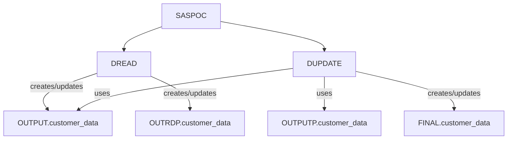

# SAS Program Execution Analysis

This document analyzes the execution flow, dependencies, and orchestration of the provided SAS programs: `SASPOC`, `DUPDATE`, and `DREAD`.

## Part 1: Pipeline Execution Architecture

### Programs List

*   `SASPOC`
*   `DUPDATE`
*   `DREAD`

### Execution Sequence

The execution order is determined by the macro calls within `SASPOC`.

`SASPOC` → `DREAD` → `DUPDATE`

### Dependency Graph

**Explanation:**

1.  `SASPOC` is the orchestrator. It calls both `DREAD` and `DUPDATE`.
2.  `DREAD` creates or updates the `OUTPUT.customer_data` and `OUTRDP.customer_data` datasets.
3.  `DUPDATE` depends on the existence of `OUTPUTP.customer_data` (previous version) and `OUTPUT.customer_data` (potentially created/updated by `DREAD`) to perform its merge operation. It then creates `FINAL.customer_data`.

**Note:** The diagram implies that `DUPDATE` *could* run in parallel with `DREAD` if its dependencies were met *independently* of `DREAD`'s output. However, since `DUPDATE` relies on `OUTPUT.customer_data`, which is produced by `DREAD`, `DREAD` must complete before `DUPDATE` can reliably execute its merge logic using the *latest* `OUTPUT.customer_data`. The `SASPOC` program explicitly calls `DREAD` first, then `DUPDATE`, establishing a sequential dependency in this specific invocation.

### Parallel Opportunities

Based on the explicit calls within `SASPOC` and the dependencies:

*   **No direct parallel opportunities for `DREAD` and `DUPDATE` in this specific execution flow.** `SASPOC` calls `DREAD` first, then `DUPDATE`. `DUPDATE` has an explicit dependency on `OUTPUT.customer_data`, which is created by `DREAD`.
*   If `OUTPUTP.customer_data` were pre-existing and `DREAD`'s creation of `OUTPUT.customer_data` was *not* a strict prerequisite for `DUPDATE`'s *initialization* phase (e.g., if `DUPDATE` could start processing with an older `OUTPUT.customer_data` and then incorporate new data), then there might be some overlap. However, the current structure implies sequential execution.

### Critical Path

The critical path is the longest dependency chain. In this pipeline, the sequence is:

`SASPOC` → `DREAD` → `DUPDATE`

Therefore, the critical path is:

**`SASPOC` → `DREAD` → `DUPDATE`**

This is because `SASPOC` initiates the process, `DREAD` must complete to produce `OUTPUT.customer_data`, and then `DUPDATE` uses `OUTPUT.customer_data` (and `OUTPUTP.customer_data`) to produce `FINAL.customer_data`.

## Part 2: Per-Program Execution Details

### Program Name: `SASPOC`

*   **Internal Step Sequence:**
    1.  Macro variable assignments (`SYSPARM1`, `SYSPARM2`, `gdate`, `PROGRAM`, `PROJECT`, `FREQ`).
    2.  `%include` statement.
    3.  `%INITIALIZE;` macro call (details not provided, but assumed to be an initialization step).
    4.  Macro variable assignments (`PREVYEAR`, `YEAR`).
    5.  `OPTIONS` statement.
    6.  `%macro call;` definition.
    7.  Inside `%call;` macro:
        *   `%ALLOCALIB(inputlib);` macro call.
        *   `%DREAD(OUT_DAT = POCOUT);` macro call.
        *   `%DUPDATE(prev_ds=OUTPUTP.customer_data, new_ds=OUTPUT.customer_data, out_ds=FINAL.customer_data);` macro call.
        *   `%DALLOCLIB(inputlib);` macro call.
    8.  `%call;` macro invocation.
    9.  `%mend;` macro end.

*   **Dataset Dependencies:**
    *   `OUTPUTP.customer_data`: Required by `%DUPDATE`. Assumed to exist prior to `SASPOC` execution or be managed externally.
    *   `OUTPUT.customer_data`: Required by `%DUPDATE`. This dataset is *created/updated* by the `%DREAD` call within `SASPOC`.

*   **Macro Execution:**
    *   Macro variable assignments (`%let`).
    *   `%include`.
    *   `%INITIALIZE;` (custom macro).
    *   `%macro call; ... %mend;` definition.
    *   `%call;` invocation.
    *   `%ALLOCALIB(inputlib);` (custom macro, likely from `%include`).
    *   `%DREAD(OUT_DAT = POCOUT);` (custom macro defined in `DREAD.sas`).
    *   `%DUPDATE(prev_ds=OUTPUTP.customer_data, new_ds=OUTPUT.customer_data, out_ds=FINAL.customer_data);` (custom macro defined in `DUPDATE.sas`).
    *   `%DALLOCLIB(inputlib);` (custom macro, likely from `%include`).

*   **RUN/QUIT Triggers:**
    *   Implicit `RUN;` after `OPTIONS` statement.
    *   Implicit `RUN;` after `proc datasets` in `DREAD` (if present).
    *   Implicit `RUN;` after `data output.customer_data; ... run;` in `DREAD`.
    *   Implicit `RUN;` after `proc datasets` in `DREAD`.
    *   Implicit `RUN;` after `data &out_ds; ... run;` in `DUPDATE`.

*   **Prerequisites:**
    *   The external file specified by the `filepath` parameter in the `DREAD` macro call must exist.
    *   The `MYLIB.&SYSPARM1..META(&FREQ.INI)` file must exist and be accessible for the `%include` statement.
    *   The `%INITIALIZE;`, `%ALLOCALIB`, and `%DALLOCLIB` macros must be defined and accessible.
    *   The libraries `OUTPUTP`, `OUTPUT`, and `FINAL` must be assigned or available.
    *   `OUTPUTP.customer_data` must exist for `DUPDATE` to function correctly.

### Program Name: `DREAD`

*   **Internal Step Sequence:**
    1.  `%macro DREAD(filepath);` definition.
    2.  `data customer_data; ... run;` (Data step to read external file).
    3.  `data OUTRDP.customer_data; set customer_data; run;` (Data step to copy `work.customer_data` to `OUTRDP.customer_data`).
    4.  `proc datasets library = work; modify customer_data; index create cust_indx = (Customer_ID); run;` (PROC step to create an index on `work.customer_data`).
    5.  `%if %SYSFUNC(EXIST(output.customer_data)) ne 1 %then %do; ... %end;` (Conditional block).
        *   Inside conditional block:
            *   `data output.customer_data; set work.customer_data; run;` (Data step to create/overwrite `output.customer_data`).
            *   `proc datasets library = output; modify customer_data; index create cust_indx = (Customer_ID); run;` (PROC step to create an index on `output.customer_data`).
    6.  `%mend DREAD;` (Macro end).

*   **Dataset Dependencies:**
    *   External file specified by `&filepath`.
    *   `work.customer_data` (created by the first data step).
    *   `OUTRDP.customer_data` (created by the second data step).
    *   `output.customer_data` (potentially created/overwritten by the conditional data step).

*   **Macro Execution:**
    *   `%macro DREAD(filepath); ... %mend DREAD;` definition.
    *   `%SYSFUNC(EXIST(...))` is a SAS function call within the macro.

*   **RUN/QUIT Triggers:**
    *   `RUN;` after the first `data customer_data;` step.
    *   `RUN;` after the `data OUTRDP.customer_data;` step.
    *   `RUN;` after the first `proc datasets;` step.
    *   `RUN;` after the `data output.customer_data;` step (inside the conditional block).
    *   `RUN;` after the second `proc datasets;` step (inside the conditional block).

*   **Prerequisites:**
    *   The external file defined by the `filepath` parameter must exist and be readable.
    *   The `work` library must be available.
    *   The `OUTRDP` library must be available.
    *   The `output` library must be available.

### Program Name: `DUPDATE`

*   **Internal Step Sequence:**
    1.  `%macro DUPDATE(prev_ds=OUTPUTP.customer_data, new_ds=OUTPUT.customer_data, out_ds=FINAL.customer_data);` definition.
    2.  `data &out_ds; ... run;` (Data step performing merge and conditional logic).
    3.  `%mend DUPDATE;` (Macro end).

*   **Dataset Dependencies:**
    *   `&prev_ds` (default: `OUTPUTP.customer_data`): Must exist and be readable.
    *   `&new_ds` (default: `OUTPUT.customer_data`): Must exist and be readable. This dataset is expected to be the output of the `DREAD` program.
    *   `&out_ds` (default: `FINAL.customer_data`): This dataset is created by this program.

*   **Macro Execution:**
    *   `%macro DUPDATE(...); ... %mend DUPDATE;` definition.

*   **RUN/QUIT Triggers:**
    *   `RUN;` after the `data &out_ds;` step.

*   **Prerequisites:**
    *   The datasets specified by `prev_ds` and `new_ds` parameters must exist and be accessible. Specifically, `OUTPUTP.customer_data` and `OUTPUT.customer_data` must be available.
    *   The `FINAL` library must be assigned or available.

## Part 3: End-to-End Use Cases

### Business Use Cases

This pipeline appears to be designed for customer data management and potentially customer onboarding or update processes. Specific use cases include:

1.  **Customer Data Ingestion and Standardization:** Reading raw customer data from an external source (`DREAD`) and preparing it for internal use, potentially including data quality checks and indexing.
2.  **Customer Master Data Maintenance:** Merging new or updated customer information (`OUTPUT.customer_data`) with existing customer master data (`OUTPUTP.customer_data`) to create a consolidated, up-to-date customer view (`FINAL.customer_data`).
3.  **Change Tracking and History:** Identifying new customers and detecting changes in existing customer records, updating validity periods (`valid_from`, `valid_to`) to maintain historical accuracy.
4.  **Data Integrity and Accessibility:** Ensuring that key customer datasets (`OUTPUT.customer_data`, `FINAL.customer_data`) are indexed for efficient querying.

### Workflow Summary

The overall workflow orchestrates the processing of customer data:

1.  **Initialization:** The `SASPOC` program starts by setting up macro variables and potentially performing global initialization steps.
2.  **Data Reading and Staging:** The `DREAD` macro is called to read customer data from an external file. It creates a `work.customer_data` dataset, copies it to `OUTRDP.customer_data`, and then conditionally creates or overwrites `output.customer_data` (and indexes it). This staged dataset serves as the "new" data source.
3.  **Master Data Update:** The `DUPDATE` macro is then called. It takes the previously established customer master data (`OUTPUTP.customer_data`) and the newly read/staged data (`OUTPUT.customer_data`) as input. It merges these datasets to identify new customers and changes in existing ones. Based on these comparisons, it generates a new version of the customer master data (`FINAL.customer_data`), ensuring that historical records are closed (`valid_to`) and new/updated records are opened (`valid_from`).
4.  **Cleanup:** Finally, `SASPOC` deallocates any libraries allocated during its execution.

This sequence ensures that new data is processed and integrated into the existing customer master data in a controlled and auditable manner.